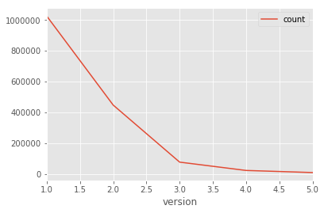

# OpenStreetMap Sample Project 
## Data Wrangling with SQL and MongoDB
### *Elsa(Yishu) Wang*

Map Area: Around **Mountain View** and **Palo Alto**, CA, USA
https://mapzen.com/data/metro-extracts/your-extracts/0e538ffd2c40

[1.Problems Encountered in the Map](#1)

- [Over-abbreviated Street Names](#1.1)
- [Different Styles of Cities and State Names](#1.2)
- [Inconsistent second level `"k"`](#1.3)
- [Inconsistent postal codes](#1.4)

[2.Data Overview](#2)

- [SQL](#2.1)
- [MongoDB](#2.2)

[3. Other Ideas about the datasets](#3)

- [Cross-field validating of `user` value](3.3)
- [Additional data exploration using SQL queries](*3.1)
- [Additional data exploration using MongoDB queries](*3.2)

## <a name="1"></a>1.Problems Encountered in the Map

After downloading the data around *Mountain View* and *Palo Alto* area, I run below code agains `data.py` to overview the fields and values:


```python
import audit
from pprint import pprint
import xml.etree.cElementTree as ET

path = 'PaloAlto_MountainView_USA.osm'
```

Check the tags and their counts


```python
tags = audit.get_tags(path)
```

    3821393 tags found.
    {'node': 1441121, 'nd': 1616553, 'bounds': 1, 'member': 8033, 'tag': 591472, 'relation': 1492, 'way': 162720, 'osm': 1}


```python
for i, element in enumerate(audit.get_element(path, tags=("node"))):
    pprint(ET.tostring(element, encoding='utf-8'))
    if i == 5:
        break
```

    '<node changeset="6776161" id="302863" lat="37.3769826" lon="-122.0677726" timestamp="2010-12-27T10:41:10Z" uid="14293" user="KindredCoda" version="4" />\n\t'
    '<node changeset="6776161" id="302864" lat="37.3740667" lon="-122.0679336" timestamp="2010-12-27T10:39:22Z" uid="14293" user="KindredCoda" version="5" />\n\t'
    '<node changeset="6774664" id="302865" lat="37.3733004" lon="-122.0677211" timestamp="2010-12-27T07:44:11Z" uid="14293" user="KindredCoda" version="4" />\n\t'
    '<node changeset="6774664" id="302866" lat="37.372597" lon="-122.0673831" timestamp="2010-12-27T07:43:52Z" uid="14293" user="KindredCoda" version="4" />\n\t'
    '<node changeset="6774664" id="302867" lat="37.3695957" lon="-122.0655646" timestamp="2010-12-27T07:43:25Z" uid="14293" user="KindredCoda" version="4" />\n\t'
    '<node changeset="6774664" id="302868" lat="37.3681888" lon="-122.0647116" timestamp="2010-12-27T07:43:04Z" uid="14293" user="KindredCoda" version="4" />\n\t'


```python
for i, element in enumerate(audit.get_element(path, tags=("way"))):
    pprint(ET.tostring(element, encoding='utf-8'))
    if i == 5:
        break
```

    '<way changeset="41607115" id="4304424" timestamp="2016-08-22T06:17:09Z" uid="933797" user="oba510" version="13">\n\t\t<nd ref="65495796" />\n\t\t<nd ref="280022084" />\n\t\t<nd ref="2425657373" />\n\t\t<nd ref="2425657370" />\n\t\t<nd ref="2425657372" />\n\t\t<nd ref="2425657371" />\n\t\t<nd ref="280022085" />\n\t\t<nd ref="3042421705" />\n\t\t<nd ref="26029084" />\n\t\t<tag k="lanes" v="1" />\n\t\t<tag k="layer" v="1" />\n\t\t<tag k="bridge" v="yes" />\n\t\t<tag k="oneway" v="yes" />\n\t\t<tag k="highway" v="secondary_link" />\n\t\t<tag k="sidewalk" v="no" />\n\t</way>\n\t'
    '<way changeset="21185174" id="4311277" timestamp="2014-03-19T01:42:37Z" uid="123633" user="stevea" version="70">\n\t\t<nd ref="26028708" />\n\t\t<nd ref="2371003215" />\n\t\t<nd ref="26678537" />\n\t\t<tag k="ref" v="G6" />\n\t\t<tag k="name" v="Central Expressway" />\n\t\t<tag k="note" v="adding odbl tag to match split of way and remove tainted tags" />\n\t\t<tag k="lanes" v="2" />\n\t\t<tag k="oneway" v="yes" />\n\t\t<tag k="highway" v="primary" />\n\t\t<tag k="maxspeed" v="35 mph" />\n\t</way>\n\t'
    '<way changeset="43242458" id="4311288" timestamp="2016-10-28T09:58:53Z" uid="3029661" user="saikabhi" version="56">\n\t\t<nd ref="262658484" />\n\t\t<nd ref="30674722" />\n\t\t<nd ref="262658486" />\n\t\t<nd ref="262658495" />\n\t\t<nd ref="30674723" />\n\t\t<nd ref="262658497" />\n\t\t<tag k="name" v="North San Antonio Road" />\n\t\t<tag k="lanes" v="2" />\n\t\t<tag k="oneway" v="yes" />\n\t\t<tag k="bicycle" v="yes" />\n\t\t<tag k="highway" v="secondary" />\n\t\t<tag k="cycleway:right" v="lane" />\n\t</way>\n\t'
    '<way changeset="49088548" id="4321995" timestamp="2017-05-30T00:45:53Z" uid="33757" user="Minh Nguyen" version="5">\n\t\t<nd ref="519661675" />\n\t\t<nd ref="4884567859" />\n\t\t<nd ref="4884567858" />\n\t\t<nd ref="519661677" />\n\t\t<nd ref="26250230" />\n\t\t<nd ref="4884567860" />\n\t\t<nd ref="26250233" />\n\t\t<nd ref="78748502" />\n\t\t<tag k="access" v="private" />\n\t\t<tag k="highway" v="service" />\n\t\t<tag k="service" v="driveway" />\n\t</way>\n\t'
    '<way changeset="13224113" id="4334869" timestamp="2012-09-23T18:21:46Z" uid="10786" user="stucki1" version="13">\n\t\t<nd ref="686277205" />\n\t\t<nd ref="686277206" />\n\t\t<nd ref="686277207" />\n\t\t<nd ref="686277208" />\n\t\t<nd ref="686277209" />\n\t\t<nd ref="686277210" />\n\t\t<nd ref="686277211" />\n\t\t<nd ref="686277212" />\n\t\t<tag k="name" v="Zook Road" />\n\t\t<tag k="highway" v="unclassified" />\n\t</way>\n\t'
    '<way changeset="26243141" id="4336012" timestamp="2014-10-21T21:10:13Z" uid="595221" user="matthieun" version="8">\n\t\t<nd ref="26391747" />\n\t\t<nd ref="26391748" />\n\t\t<nd ref="3142668532" />\n\t\t<nd ref="3142668531" />\n\t\t<nd ref="3142668530" />\n\t\t<nd ref="26391753" />\n\t\t<nd ref="26391770" />\n\t\t<nd ref="26391769" />\n\t\t<nd ref="26391768" />\n\t\t<nd ref="3142667716" />\n\t\t<nd ref="26391763" />\n\t\t<nd ref="3142667715" />\n\t\t<nd ref="26391764" />\n\t\t<nd ref="26391765" />\n\t\t<nd ref="3142667717" />\n\t\t<nd ref="26391766" />\n\t\t<nd ref="26391767" />\n\t\t<nd ref="26391762" />\n\t\t<nd ref="3142667718" />\n\t\t<nd ref="3142667719" />\n\t\t<nd ref="26391758" />\n\t\t<nd ref="3142668544" />\n\t\t<nd ref="3142668545" />\n\t\t<nd ref="26391757" />\n\t\t<nd ref="26391756" />\n\t\t<nd ref="26391755" />\n\t\t<nd ref="26391754" />\n\t\t<nd ref="26391743" />\n\t\t<nd ref="26391744" />\n\t\t<nd ref="26391746" />\n\t\t<nd ref="26391747" />\n\t\t<tag k="name" v="Hangar One" />\n\t\t<tag k="image" v="http://commons.wikimedia.org/wiki/File:Last_Look_at_Hangar_One.jpg" />\n\t\t<tag k="aeroway" v="hangar" />\n\t\t<tag k="building" v="yes" />\n\t\t<tag k="wikipedia" v="en:Hangar One (Mountain View, California)" />\n\t\t<tag k="start_date" v="1933" />\n\t</way>\n\t'


It seems the structures and tags of this file are similiar to the example.osm. Next, I check the value for `tag` in order to have a sense of the potential fields:


```python
keys = audit.key_type(path)
set(keys['other'])
```


    {'ALAND',
     'ANSICODE',
     'AREAID',
     'AWATER',
     'Acres',
     'COUNTYFP',
     'FIXME',
     'FMMP_modified',
     'FMMP_reviewed',
     'GENERIC',
     'HFCS',
     'MTFCC',
     'NHS',
     'OBJECTID',
     'SHAPE_STAr',
     'SHAPE_STLe',
     'STATEFP',
     'Tiger:HYDROID',
     'Tiger:MTFCC',
     'Zoning',
     'addr:1:housenumber',
     'addr:1:street',
     'addr:2:housenumber',
     'addr:3:housenumber',
     'addr:4:housenumber',
     'addr:4:street',
     'addr:5:housenumber',
     'addr:5:street',
     'addr:6:housenumber',
     'addr:7:housenumber',
     'addr:8:housenumber',
     'addr:street:suffix',
     'addr:street:type',
     'addr:unit_1',
     'amenity_1',
     'building:levels:underground',
     'building:use:parking',
     'building_1',
     'change:lanes:backward',
     'change:lanes:forward',
     'currency:USD',
     'destination:street:to',
     'disused:healthcare:specialty',
     'disused:website:official',
     'generator:output:electricity',
     'gnis:Class',
     'gnis:County',
     'gnis:County_num',
     'gnis:ST_alpha',
     'gnis:ST_num',
     'is_in:iso_3166_2',
     'leisure_1',
     'mrosd:name_2',
     'mrosd:name_3',
     'mtb:scale:uphill',
     'name2',
     'name:zh-cn',
     'name:zh-hant',
     'name_1',
     'name_2',
     'name_3',
     'ref:MVgo',
     'ref:VTA',
     'roof:slope:direction',
     'scvwd:AREA_AC',
     'scvwd:AREA_FT',
     'scvwd:COVERED',
     'scvwd:FACILITY',
     'scvwd:NAME',
     'scvwd:OBJECTID',
     'scvwd:POND_NUM',
     'scvwd:ROUTEID',
     'scvwd:SHAPE_AREA',
     'scvwd:SHAPE_Area',
     'scvwd:WB_TYPE',
     'seamark:beacon_lateral:category',
     'seamark:beacon_lateral:colour',
     'seamark:beacon_lateral:shape',
     'service:bicycle:chain_tool',
     'service:bicycle:pump',
     'service:vehicle:oil_change',
     'service:vehicle:used_car_sales',
     'shop_1',
     'sidewalk:right:kerb',
     'sidewalk:right:surface',
     'sidewalk_1',
     'socket:type1',
     'socket:type1_combo',
     'source:addr:unit',
     'source:capacity:disabled',
     'source:hgv:national_network',
     'source:hgv:state_network',
     'tiger:CLASSFP',
     'tiger:CPI',
     'tiger:FUNCSTAT',
     'tiger:LINEARID',
     'tiger:LSAD',
     'tiger:MTFCC',
     'tiger:NAME',
     'tiger:NAMELSAD',
     'tiger:PCICBSA',
     'tiger:PCINECTA',
     'tiger:PLACEFP',
     'tiger:PLACENS',
     'tiger:PLCIDFP',
     'tiger:RTTYP',
     'tiger:STATEFP',
     'tiger:name_base_1',
     'tiger:name_base_2',
     'tiger:name_base_3',
     'tiger:name_direction_prefix_1',
     'tiger:name_direction_suffix_1',
     'tiger:name_type_1',
     'tiger:name_type_2',
     'tiger:name_type_3',
     'turn:lanes:backward',
     'turn:lanes:both_ways',
     'turn:lanes:forward',
     'url_1'}


Then I pick some values of k to check the details:

```
'addr:street' 'addr:postcode' 'addr:state' 
'addr:city' 'addr:county', 'AWATER'
```


```python
audit.find_interest(path, 'addr:street', 10)
```

    '<tag k="addr:street" v="South Fair Oaks Avenue" />\n\t\t'
    '<tag k="addr:street" v="West El Camino Real" />\n\t\t'
    '<tag k="addr:street" v="West El Camino Real" />'
    '<tag k="addr:street" v="West El Camino Real" />\n\t\t'
    '<tag k="addr:street" v="West El Camino Real" />\n\t\t'
    '<tag k="addr:street" v="East El Camino Real" />\n\t\t'
    '<tag k="addr:street" v="East Remington Drive" />\n\t\t'
    '<tag k="addr:street" v="Hollenbeck Ave" />\n\t\t'
    '<tag k="addr:street" v="West Evelyn Avenue" />\n\t\t'
    '<tag k="addr:street" v="Lagunita Drive" />\n\t\t'


By looking some details of the choosen values of `k`, I noticed five main problems with the data, which I will discuss in the following order:

- Over-abbreviated Street Names:

```
<tag k="addr:street" v="Hollenbeck Ave">
<tag k="addr:street" v="Crane st">
```

- Different Styles of Cities and State Names:

```
"ca", "CA", "California"`
"157", 'Sunnyvale, CA'
'cupertino', 'San José'
```

- Inconsistent second level "k": `'AREAID', 'AWATER', 'Acres'`
- Inconsistent postal codes: `'CA 95014', 'CUPERTINO'`
```

### <a name="1.1"></a>Over-abbreviated Street Names

I use below function in `audit.py` to fix the over-abbreviated street names and the `mapping_streetname` dictionaries defined to according to the previous database exploring.

```python
def update_name(name, mapping=mapping_streetname):
    words = name.split()
    for w in range(len(words)):
        if words[w] in mapping:
            if words[w­].lower() not in ['suite', 'ste.', 'ste']:
                # For example, don't update 'Suite E' to 'Suite East'
                words[w] = mapping[words[w]]
                name = " ".join(words)
    return name
```

### <a name="1.2"></a>Different Styles of Cities and State Names

Luckily, there are only 7 cities and one state in choosen area, so I use the most common name to replace the inconsistent names of cities and state by below code:

```python
def update_city(name, mapping=mapping_cityandstatename):
    if name in mapping:
        name = mapping[name]
    return name
```

### <a name="1.3"></a>Inconsistent second level "k"

I solve it simply by using `.lower()` feature of `string` without difining new fuction.

### <a name="1.4"></a>Inconsistent postal codes

There're two problems of the postal codes. First, the code with abbreviation of california, and the second it uses city name not a postal code. In this step, I only fix the first problem by extracting the digital part of postal codes.

```python
error_post = re.compile(r'(^\D*)(\s)(\d.*)')

def update_post(post):
    if error_post.search(post):
        post = error_post.match(post)[3]
    return post
```

## <a name="2"></a>2.Data Overview

### <a name="2.1"></a>SQL

By modifying code from course for shaping data and combining above clean code, I executed `toCSV.py` to transform audited and cleaned data to `csv` files. Then, I imported these files into a local SQLite database with code below:

Import `.csv` data into `OSM.db`

```sql
.read data_wrangling_schema.sql
.import nodes.csv nodes
.import nodes_tags.csv nodes_tags
.import ways.csv ways
.import ways_tags.csv ways_tags
.import ways_nodes.csv ways_nodes
```

Connect to python `sqlite3` API


```python
import sqlite3
```


```python
db = sqlite3.connect("SQL/OSM.db")
c = db.cursor()
```

#### File sizes

```
PaloAlto_MountainView_USA.osm ... 308.4 MB
OSM.db .......................... 162.8 MB
nodes.csv ....................... 121.3 MB
nodes_tags.csv .................. 2.6 MB
ways.csv ........................ 9.8 MB
ways_tags.csv ................... 17.9 MB
ways_nodes.csv .................. 38.9 MB
```

#### Checkout quality of audited database


```python
### check postcode
query = '''select tags.value, count(*) as count
           from (select * from nodes_tags
                 union all
                select * from ways_tags) tags
            where tags.key = 'postcode'
            group by tags.value
            order by count
            limit 10'''
c.execute(query)
c.fetchall()
```


    [(u'30188', 1),
     (u'515', 1),
     (u'94025-1246', 1),
     (u'94035', 1),
     (u'94035-0016', 1),
     (u'9404', 1),
     (u'94043-3421', 1),
     (u'94084', 1),
     (u'94087-2248', 1),
     (u'94087\u200e', 1)]


```python
### look over inconsistent data
query = '''select *
           from (select * from nodes_tags
                 union all
                select * from ways_tags) tags
            where tags.key='postcode'
            and (tags.value = '30188'
            or tags.value = '515')
            '''
c.execute(query)
c.fetchall()
```


    [(112708857, u'postcode', u'515', u'addr'),
     (264858644, u'postcode', u'30188', u'addr')]


```python
query = '''select * from ways_tags where id=112708857 or id=264858644 and type = 'addr'
'''
c.execute(query)
c.fetchall()
```


    [(112708857, u'source', u'bing', u'regular'),
     (112708857, u'building', u'yes', u'regular'),
     (112708857, u'postcode', u'515', u'addr'),
     (112708857, u'housenumber', u'515', u'addr'),
     (264858644, u'city', u'Mountain View', u'addr'),
     (264858644, u'street', u'Escuela Avenue', u'addr'),
     (264858644, u'postcode', u'30188', u'addr'),
     (264858644, u'housenumber', u'586', u'addr')]


By searching online, I found that the address with '30188' postcode is a wrong, and the right postcode should be '94040'. Thus, I rectified the data with sqlite code below:

```sql
update ways_tags set value='94040' where (id=264858644 and key='postcode');
```


```python
query = '''select * from ways_tags where id=112708857 or id=264858644 and type = 'addr'
'''
c.execute(query)
c.fetchall()
```


    [(112708857, u'source', u'bing', u'regular'),
     (112708857, u'building', u'yes', u'regular'),
     (112708857, u'postcode', u'515', u'addr'),
     (112708857, u'housenumber', u'515', u'addr'),
     (264858644, u'city', u'Mountain View', u'addr'),
     (264858644, u'street', u'Escuela Avenue', u'addr'),
     (264858644, u'postcode', u'94040', u'addr'),
     (264858644, u'housenumber', u'586', u'addr')]


Because I couldn't find enough data to know where is the '515' address, I decide to leave it in database

#### Number of nodes


```python
query = '''select count(*) from nodes'''
c.execute(query)
c.fetchall()[0][0]
```


    1441121


#### Number of ways


```python
query = '''select count(*) from ways'''
c.execute(query)
c.fetchall()[0][0]
```


    162720


#### The distribution of version of nodes and ways


```python
query = '''select e.version, count(*) as num
           from (select version from nodes union all
           select version from ways) e
           group by version
           order by num desc'''
c.execute(query)
version_dist = c.fetchall()
```


```python
import pandas as pd    
df = pd.DataFrame(version_dist)
print df
```

          0        1
    0     1  1025351
    1     2   448139
    2     3    78139
    3     4    24148
    4     5    10546
    5     6     5840
    6     7     3483
    7     8     2086
    8     9     1453
    9    10      995
    10   11      612
    11   12      513
    12   13      365
    13   14      362
    14   15      236
    15   16      219
    16   17      171
    17   18      166
    18   22      128
    19   19      115
    20   24      101
    21   21       91
    22   23       90
    23   25       71
    24   20       69
    25   27       38
    26   30       36
    27   28       35
    28   26       34
    29   29       30
    ..  ...      ...
    35   35       10
    36   41       10
    37   36        9
    38   42        8
    39   38        7
    40   46        7
    41   39        6
    42   48        6
    43   45        4
    44   47        4
    45   37        3
    46   43        3
    47   51        3
    48   44        2
    49   49        2
    50   50        2
    51   59        2
    52   52        1
    53   54        1
    54   55        1
    55   56        1
    56   63        1
    57   67        1
    58   68        1
    59   70        1
    60   73        1
    61   74        1
    62   79        1
    63   83        1
    64  145        1
    
    [65 rows x 2 columns]


#### Top 10 nodes shared with ways


```python
query = '''select ways_nodes.node_id, i.value, count(*) as num
           from ways_nodes
               join (select distinct(id), * from nodes_tags
           where nodes_tags.key = 'name') i
               on  ways_nodes.node_id = i.id
           group by ways_nodes.node_id
           order by num desc
           limit 10;'''
c.execute(query)
c.fetchall()
```


    [(65560159, u'Escalon Ave ends here', 3),
     (3404870013, u'Calabazas Step-Up Jump', 3),
     (65387340, u'SR07', 2),
     (267888019, u'575', 2),
     (1389239042, u'Google Building 1965 lobby', 2),
     (2697101145, u'In Her Shoes', 2),
     (3176076002, u'RR03', 2),
     (3537007147, u'Loft House Leasing Office', 2),
     (4097853389, u'gate', 2),
     (4227636890, u'SR03', 2)]


#### The number of Library and University

I'd like to continue education in this area, so I'm interested in how many libraries and universities in this area. Library:


```python
query = '''select count(*) from
           (select distinct(id) from nodes_tags where
           value='library')
        '''
c.execute(query)
c.fetchall()[0][0]
```


    17


University:


```python
query = '''select count(*) from
           (select distinct(id) from nodes_tags where
           value='university')
        '''
c.execute(query)
c.fetchall()[0][0]
```


    2


### <a name="2.2"></a>MongoDB

Same as SQL, I executed `toJSON` for shaping the data into `JSON` file, and then I imported data into MongoDB


```python
from pymongo import MongoClient, GEO2D
import toJSON
```


```python
client = MongoClient('mongodb://localhost:27017/')
db = client.osm
```


```python
osm_map = toJSON.process_map(path)
db.maps.insert_many(osm_map)
```


    <pymongo.results.InsertManyResult at 0x198acb190>


#### File size:
```
PaloAlto_MountainView_USA.osm ....... 308.4MB
PaloAlto_MountainView_USA.osm.json .. 345.7MB
```

#### Number of documents, nodes, ways and positions


```python
db.maps.find().count()
```


    1603841


```python
db.maps.find({"type": "node"}).count()
```


    1441121


```python
db.maps.find({"type": "way"}).count()
```


    162720


```python
db.maps.find({"pos":{"$exists":1}}).count()
```


    1441121


Also, I need to update the wrong postcode manually:


```python
node = db.maps.find_one({"id":"264858644"})
node['address']['postcode'] = "94040"
db.maps.save(node)
```

    /Users/ElsaW/anaconda/envs/py2/lib/python2.7/site-packages/ipykernel_launcher.py:3: DeprecationWarning: save is deprecated. Use insert_one or replace_one instead
      This is separate from the ipykernel package so we can avoid doing imports until


    ObjectId('596c18bb0a36f707180608a0')


#### Sort postcodes by counting


```python
result = db.maps.aggregate([{"$match":{"address.postcode":{"$exists":1}}}, 
                   {"$group":{"_id":"$address.postcode", "count":{"$sum":1}}}, 
                   {"$sort":{"count":1}},
                   {"$limit":10}                  
                  ])
```

#### Sort street by counting


```python
result = db.maps.aggregate([{"$match":{"address.street":{"$exists":1}}}, 
                   {"$group":{"_id":"$address.street", "count":{"$sum":1}}}, 
                   {"$sort":{"count":1}},
                   {"$limit":10}                  
                  ])
```


```python
for i in result:
    pprint(i)
```

    {u'_id': u'Chiala Lane', u'count': 1}
    {u'_id': u'East Eaglewood Avenue', u'count': 1}
    {u'_id': u'East Charleston Road APT 9', u'count': 1}
    {u'_id': u'Leghorn Street #B', u'count': 1}
    {u'_id': u'West Portola Avenue', u'count': 1}
    {u'_id': u'Moraga Drive', u'count': 1}
    {u'_id': u'Facebook Way', u'count': 1}
    {u'_id': u'Bell Street', u'count': 1}
    {u'_id': u'Tami Way', u'count': 1}
    {u'_id': u'Whits Road', u'count': 1}


#### Sort city by counting


```python
result = db.maps.aggregate([{"$match":{"address.city":{"$exists":1}}}, 
                   {"$group":{"_id":"$address.city", "count":{"$sum":1}}}, 
                   {"$sort":{"count":-1}},
                  ])
```


```python
for i in result:
    pprint(i)
```

    {u'_id': u'Palo Alto', u'count': 19315}
    {u'_id': u'Redwood City', u'count': 4536}
    {u'_id': u'Sunnyvale', u'count': 2474}
    {u'_id': u'Mountain View', u'count': 2450}
    {u'_id': u'Stanford', u'count': 353}
    {u'_id': u'Los Altos', u'count': 228}
    {u'_id': u'Menlo Park', u'count': 60}
    {u'_id': u'Cupertino', u'count': 58}
    {u'_id': u'Portola Valley', u'count': 21}
    {u'_id': u'San Jos\xe9', u'count': 20}
    {u'_id': u'Atherton', u'count': 10}
    {u'_id': u'Artherton', u'count': 7}
    {u'_id': u'Saratoga', u'count': 3}
    {u'_id': u'San Jose', u'count': 3}
    {u'_id': u'Moffett Field', u'count': 2}
    {u'_id': u'', u'count': 1}
    {u'_id': u'157', u'count': 1}
    {u'_id': u'155', u'count': 1}
    {u'_id': u'South Mary Avenue', u'count': 1}
    {u'_id': u'Santa Clara County', u'count': 1}


```python
db.maps.find_one({"address.city":"157"})
```


    {u'_id': ObjectId('596b2c990a36f77a7e8db4a3'),
     u'address': {u'city': u'157', u'housenumber': u'157'},
     u'created': {u'changeset': u'35731862',
      u'timestamp': u'2015-12-03T17:38:28Z',
      u'uid': u'1240849',
      u'user': u'ediyes',
      u'version': u'5'},
     u'id': u'112021516',
     u'node_refs': [u'1274542749',
      u'1274542720',
      u'1274542724',
      u'1274542735',
      u'3874884254',
      u'3874884253',
      u'1274542749'],
     u'type': u'way'}


Even after auditing and cleaning, there're still a few of documents that cannot be corrected. Take account of limited number of these data, I decide to not do anything of them.

## <a name="3"></a>3.Other Ideas about the datasets

### <a name="3.3"></a>Cross-field validating of `user` value

The dataset could provide same information by different fields and they could use to cross-validating the consistency and accuracy of the dataset. Here I'd like to use `user` and `uid` fields to improve the quality of data.

#### Imputing missing data

During auditing, I found some value of users are empty, and I set those users' values to 'NA'. Becasue the dataset has both `uid` and `user`, It is possible to impute the `user` if they have `uid` value.


```python
Nas = db.maps.find({"created.user": "NA"},{"created.uid":1, "_id":0, "created.user":1})
```


```python
for na in Nas:
    pprint(na)
```

    {u'created': {u'uid': u'NA', u'user': u'NA'}}
    {u'created': {u'uid': u'NA', u'user': u'NA'}}
    {u'created': {u'uid': u'NA', u'user': u'NA'}}
    {u'created': {u'uid': u'NA', u'user': u'NA'}}


Oops, the query result is negative. It seems we can not correct those missing value from inside of this database, but it could be a good try to audit data for a larger scale.

#### Consistent of `user` and `uid`

According to *OpenStreetMap*, each `uid` should be responded to one and only one `user`, which means the number of unique `user` should be equal to the number of `uid`.

##### Inconsistent user and uid


```python
len(db.maps.distinct("created.user"))
```


    1076


```python
len(db.maps.distinct("created.uid"))
```


    1075


Interstingly, there is one more `user` name than `uid`. It breaks the consistency of `uid` and `user`. Let we find what happend:


```python
result = db.maps.aggregate([
    {"$group": {"_id": "$created.uid",
                "count":{"$sum": 1},
                "users": {"$addToSet": "$created.user"}}},
    {"$project": {"_id":1,
                  "count":1,
                  "users": 1,
                  "size of name": {"$size": "$users"}}},
    {"$match": {"size of name": {"$gt": 1}}}   
])
```


```python
for r in result:
    pprint(r)
```

    {u'_id': u'6022281',
     u'count': 70,
     u'size of name': 2,
     u'users': [u'Dana Bringas', u'Dana_Bringas']}


```python
db.maps.find({"created.user":"Dana Bringas"}).count()
```


    19


```python
db.maps.find({"created.user":"Dana_Bringas"}).count()
```


    51


There're different rules for blank between first and last name. Let we fix it:


```python
names = db.maps.find({"created.user":"Dana_Bringas"})
for name in names:
    name['created']['user'] = "Dana Bringas"
    db.maps.save(name)
```

    /Users/ElsaW/anaconda/envs/py2/lib/python2.7/site-packages/ipykernel_launcher.py:4: DeprecationWarning: save is deprecated. Use insert_one or replace_one instead
      after removing the cwd from sys.path.


```python
len(db.maps.distinct("created.user"))
```


    1075


#### Discussion

For the situation like above, there could be two solutions:

- remove missing or inconsistent values
- fix them via cross-validating from inside or outside database

First solution is easy and fast. Generally, for a big enough dataset, to remove small parts of data will not affect its accuracy to analysis. However, if missing and inconsistent values take too much account of the dataset, we must be really careful for making *delete* decision, because the data quality will be feasible by removing large parts of data.

Second solution seems to be safer than the first one. It could be keep the total volumn of dataset and set values for each missing data. However, two possible disadvantages are still there. It's hard to ensure the data quality after imputing or correcting. Some operations to *fix* data actually mess up data. Also, if need-to-fix data is too large, the whole process will take much time and energy, which may cause the increase of cost.

Thus, my suggestion for handling the missing and inconsistent data is that to balance the data size and cost. At this project, I chose to fix the data for two reasons: fist, the number of data is not too small to ignore it, there are 70 posts about the inconsistent names; second, it's relatively easy to fix it-only one name needed to update. However, the anticipated issus of this operation should be remebered. I fixed the name under the assumption that two user names are the same one, but what if they actually two users, and the system assigned the same uid for them mistakely?

### <a name="3.1"></a>Additional data exploration using SQL queries

The OpenStreetMaps are updated by users manualy, which means that the version times show the users' concentrations on the area. To explore the `version` could time the users' behaviour when they edit the OSM online. The larger `version` value implies the high attention, vice versa.


```python
import matplotlib.pyplot as plt
import matplotlib
matplotlib.style.use('ggplot')
%matplotlib inline 
```


```python
df = df.rename(index=str, columns={0: "version", 1: "count"})
df = df.set_index('version')
```


```python
df
```


<div>
<style>
    .dataframe thead tr:only-child th {
        text-align: right;
    }

    .dataframe thead th {
        text-align: left;
    }

    .dataframe tbody tr th {
        vertical-align: top;
    }
</style>
<table border="1" class="dataframe">
  <thead>
    <tr style="text-align: right;">
      <th></th>
      <th>count</th>
    </tr>
    <tr>
      <th>version</th>
      <th></th>
    </tr>
  </thead>
  <tbody>
    <tr>
      <th>1</th>
      <td>1025351</td>
    </tr>
    <tr>
      <th>2</th>
      <td>448139</td>
    </tr>
    <tr>
      <th>3</th>
      <td>78139</td>
    </tr>
    <tr>
      <th>4</th>
      <td>24148</td>
    </tr>
    <tr>
      <th>5</th>
      <td>10546</td>
    </tr>
    <tr>
      <th>6</th>
      <td>5840</td>
    </tr>
    <tr>
      <th>7</th>
      <td>3483</td>
    </tr>
    <tr>
      <th>8</th>
      <td>2086</td>
    </tr>
    <tr>
      <th>9</th>
      <td>1453</td>
    </tr>
    <tr>
      <th>10</th>
      <td>995</td>
    </tr>
    <tr>
      <th>11</th>
      <td>612</td>
    </tr>
    <tr>
      <th>12</th>
      <td>513</td>
    </tr>
    <tr>
      <th>13</th>
      <td>365</td>
    </tr>
    <tr>
      <th>14</th>
      <td>362</td>
    </tr>
    <tr>
      <th>15</th>
      <td>236</td>
    </tr>
    <tr>
      <th>16</th>
      <td>219</td>
    </tr>
    <tr>
      <th>17</th>
      <td>171</td>
    </tr>
    <tr>
      <th>18</th>
      <td>166</td>
    </tr>
    <tr>
      <th>22</th>
      <td>128</td>
    </tr>
    <tr>
      <th>19</th>
      <td>115</td>
    </tr>
    <tr>
      <th>24</th>
      <td>101</td>
    </tr>
    <tr>
      <th>21</th>
      <td>91</td>
    </tr>
    <tr>
      <th>23</th>
      <td>90</td>
    </tr>
    <tr>
      <th>25</th>
      <td>71</td>
    </tr>
    <tr>
      <th>20</th>
      <td>69</td>
    </tr>
    <tr>
      <th>27</th>
      <td>38</td>
    </tr>
    <tr>
      <th>30</th>
      <td>36</td>
    </tr>
    <tr>
      <th>28</th>
      <td>35</td>
    </tr>
    <tr>
      <th>26</th>
      <td>34</td>
    </tr>
    <tr>
      <th>29</th>
      <td>30</td>
    </tr>
    <tr>
      <th>...</th>
      <td>...</td>
    </tr>
    <tr>
      <th>35</th>
      <td>10</td>
    </tr>
    <tr>
      <th>41</th>
      <td>10</td>
    </tr>
    <tr>
      <th>36</th>
      <td>9</td>
    </tr>
    <tr>
      <th>42</th>
      <td>8</td>
    </tr>
    <tr>
      <th>38</th>
      <td>7</td>
    </tr>
    <tr>
      <th>46</th>
      <td>7</td>
    </tr>
    <tr>
      <th>39</th>
      <td>6</td>
    </tr>
    <tr>
      <th>48</th>
      <td>6</td>
    </tr>
    <tr>
      <th>45</th>
      <td>4</td>
    </tr>
    <tr>
      <th>47</th>
      <td>4</td>
    </tr>
    <tr>
      <th>37</th>
      <td>3</td>
    </tr>
    <tr>
      <th>43</th>
      <td>3</td>
    </tr>
    <tr>
      <th>51</th>
      <td>3</td>
    </tr>
    <tr>
      <th>44</th>
      <td>2</td>
    </tr>
    <tr>
      <th>49</th>
      <td>2</td>
    </tr>
    <tr>
      <th>50</th>
      <td>2</td>
    </tr>
    <tr>
      <th>59</th>
      <td>2</td>
    </tr>
    <tr>
      <th>52</th>
      <td>1</td>
    </tr>
    <tr>
      <th>54</th>
      <td>1</td>
    </tr>
    <tr>
      <th>55</th>
      <td>1</td>
    </tr>
    <tr>
      <th>56</th>
      <td>1</td>
    </tr>
    <tr>
      <th>63</th>
      <td>1</td>
    </tr>
    <tr>
      <th>67</th>
      <td>1</td>
    </tr>
    <tr>
      <th>68</th>
      <td>1</td>
    </tr>
    <tr>
      <th>70</th>
      <td>1</td>
    </tr>
    <tr>
      <th>73</th>
      <td>1</td>
    </tr>
    <tr>
      <th>74</th>
      <td>1</td>
    </tr>
    <tr>
      <th>79</th>
      <td>1</td>
    </tr>
    <tr>
      <th>83</th>
      <td>1</td>
    </tr>
    <tr>
      <th>145</th>
      <td>1</td>
    </tr>
  </tbody>
</table>
<p>65 rows × 1 columns</p>
</div>


```python
df[0:5].plot()
```


    <matplotlib.axes._subplots.AxesSubplot at 0x1ea6e66d0>





```python
df[5:].plot()
```


    <matplotlib.axes._subplots.AxesSubplot at 0x1e9770e90>


Most of (over 63%) nodes and ways at this area are just edited once, 28% of nodes and ways are updated once after first inputing, only about 5% nodes and ways are updated twice after first inputing. This result implies that the data of OSM in this area might be out of date to some extent.

Also, some nodes and ways show the unusal high version, such as 83 times updated and 145 times updated. Let we explore them and try to find the reason by the data.


```python
query = '''select *
           from ways
            where version = 83 or version = 145
            '''
c.execute(query)
c.fetchall()
```


    [(4786675, u'n76', 318696, 145, 17945349, u'2013-09-20T19:04:10Z'),
     (4809373, u'nikhilprabhakar', 2835928, 83, 38445809, u'2016-04-10T09:12:58Z')]


```python
query = '''select *
           from ways_tags
            where id = 4786675 or id = 4809373
            '''
c.execute(query)
c.fetchall()
```


    [(4786675, u'hgv', u'designated', u'regular'),
     (4786675, u'ref', u'I 280', u'regular'),
     (4786675, u'foot', u'no', u'regular'),
     (4786675, u'name', u'Junipero Serra Freeway', u'regular'),
     (4786675, u'horse', u'no', u'regular'),
     (4786675, u'lanes', u'4', u'regular'),
     (4786675, u'oneway', u'yes', u'regular'),
     (4786675, u'bicycle', u'no', u'regular'),
     (4786675, u'highway', u'motorway', u'regular'),
     (4786675, u'maxspeed', u'65 mph', u'regular'),
     (4786675, u'sidewalk', u'none', u'regular'),
     (4786675, u'hgv', u'55 mph', u'maxspeed'),
     (4786675, u'maxspeed', u'sign', u'source'),
     (4786675, u'trailer', u'55 mph', u'maxspeed'),
     (4809373, u'hgv', u'designated', u'regular'),
     (4809373, u'ref', u'CA 82', u'regular'),
     (4809373, u'name', u'East El Camino Real', u'regular'),
     (4809373, u'lanes', u'4', u'regular'),
     (4809373, u'oneway', u'yes', u'regular'),
     (4809373, u'highway', u'primary', u'regular'),
     (4809373, u'old_ref', u'US 101', u'regular'),
     (4809373, u'surface', u'asphalt', u'regular'),
     (4809373, u'maxspeed', u'40 mph', u'regular'),
     (4809373, u'lanes', u'|||right', u'turn'),
     (4809373, u'national_network', u'terminal_access', u'hgv'),
     (4809373,
      u'hgv:national_network',
      u'Caltrans http://www.dot.ca.gov/hq/traffops/trucks/truckmap/',
      u'source')]


The exploration shows that two unusual updated points are road type ways. Their high number of number may be caused by road construction or traffic rules changes frequently...

##### Top 10 appearing amenties


```python
query = '''select value, count(*) as num
           from nodes_tags
            where key = "amenity"
            group by value
            order by num desc
            limit 10;
            '''
c.execute(query)
c.fetchall()
```


    [(u'restaurant', 388),
     (u'bicycle_parking', 356),
     (u'bench', 302),
     (u'post_box', 191),
     (u'cafe', 151),
     (u'fast_food', 126),
     (u'drinking_water', 110),
     (u'parking_entrance', 75),
     (u'toilets', 74),
     (u'atm', 55)]


##### Most popular type of cafe


```python
query = '''select nodes_tags.value, count(*) as num
           from nodes_tags
                join (select distinct(id) from nodes_tags where value="cafe") i
                on nodes_tags.id= i.id
            where nodes_tags.key="cuisine"
            group by value
            order by num desc;
            '''
c.execute(query)
c.fetchall()
```


    [(u'coffee_shop', 24),
     (u'american', 4),
     (u'bubble_tea', 3),
     (u'tea', 3),
     (u'bagels', 2),
     (u'regional', 2),
     (u'sandwich', 2),
     (u'Japanese', 1),
     (u'Mexican, salads, sandwiches, gelato, frittata, cakes', 1),
     (u'bagel', 1),
     (u'boba_&_snacks', 1),
     (u'chinese', 1),
     (u'coffee, pastries, ice cream', 1),
     (u'deli', 1),
     (u'dessert', 1),
     (u'dim_sum', 1),
     (u'french', 1),
     (u'ice_cream', 1),
     (u'indian', 1),
     (u'italian', 1),
     (u'mediterranean', 1),
     (u'pizza;japanese;indian', 1),
     (u'vietnamese', 1)]


Oops, I wonder what's the "vietanmese" type of coffee shop!

### <a name="3.2"></a>Additional data exploration using MongoDB queries


```python
## Create geospatial indexing
db.maps.create_index([("pos", GEO2D)])
```


    u'pos_2d'


Well, I'm planing to visit Google at Mountain View, so I'd like to explore the Google area and make a *perfect plan* before I leave :)


```python
### Find Google GPS location
db.maps.find_one({"name": "Google Visitor Center"},{"name": 1, "pos": 1, "_id": 0})
```


    {u'name': u'Google Visitor Center', u'pos': [37.4194653, -122.0875371]}


##### Top 10 neareast restaurants around Google


```python
result = db.maps.aggregate(
[{"$geoNear":{
    "near":[37.4194653, -122.0875371],
    "distanceField": "distance",
    "maxDistance": 1000,
    "query": {"amenity": "restaurant"},
    }},
 {"$project": {"phone":1, "name" :1, "_id": 0, "distance":1, "cuisine":1, "address": 1, }},
 {"$sort": {"distance": 1}},
 {"$limit":10}
])
```


```python
for i in result:
    pprint(i)
```

    {u'address': {u'city': u'Mountain View',
                  u'housenumber': u'2025',
                  u'postcode': u'94043',
                  u'state': u'California',
                  u'street': u'Garcia Avenue'},
     u'distance': 0.006216221875054424,
     u'name': u'Crave'}
    {u'distance': 0.008263659253622616, u'name': u'Evolution Cafe'}
    {u'cuisine': u'indian;pakistani',
     u'distance': 0.00873932670747542,
     u'name': u'Zareen\u2019s'}
    {u'address': {u'city': u'Mountain View',
                  u'housenumber': u'2430',
                  u'postcode': u'94043',
                  u'state': u'California',
                  u'street': u'East Charleston Road'},
     u'cuisine': u'barbecue',
     u'distance': 0.009234248188122927,
     u'name': u'L&L Hawaiian Barbecue'}
    {u'address': {u'city': u'Mountain View',
                  u'housenumber': u'1390',
                  u'postcode': u'94043',
                  u'state': u'California',
                  u'street': u'Pear Avenue'},
     u'cuisine': u'italian',
     u'distance': 0.010523310430669652,
     u'name': u'Cucina Venti'}
    {u'address': {u'city': u'Mountain View',
                  u'housenumber': u'1390',
                  u'postcode': u'94043',
                  u'state': u'California',
                  u'street': u'Pear Avenue'},
     u'cuisine': u'tapas',
     u'distance': 0.010595235533019495,
     u'name': u'The Voya Restaurant',
     u'phone': u'+1 650 386-6471'}
    {u'address': {u'city': u'Mountain View',
                  u'housenumber': u'580',
                  u'postcode': u'94043',
                  u'street': u'North Rengstorff Avenue',
                  u'unit': u'J'},
     u'cuisine': u'japanese',
     u'distance': 0.010755303890634345,
     u'name': u'Kumino Noodle & Rice',
     u'phone': u'+16509643300'}
    {u'distance': 0.011604269752974284, u'name': u"Baji's Cafe"}
    {u'address': {u'city': u'Mountain View',
                  u'housenumber': u'3160',
                  u'street': u'North Shoreline Boulevard'},
     u'cuisine': u'american',
     u'distance': 0.01314007775814358,
     u'name': u'American Bistro'}
    {u'cuisine': u'mexican;salvadoran',
     u'distance': 0.01853008516385737,
     u'name': u'Rinc\xf3n Sabroso'}


##### Check most popular cuisine wihtin 5km around Google


```python
result = db.maps.aggregate(
[{"$geoNear":{
    "near":[37.4194653, -122.0875371],
    "distanceField": "distance",
    "maxDistance": 5000,
    "query": {"amenity": "restaurant"}
    }},
 {"$group": {"_id":"$cuisine", "count":{"$sum":1}}},
 {"$sort": {"count": -1}},
 {"$limit": 10}
])
```


```python
for i in result:
    pprint(i)
```

    {u'_id': None, u'count': 17}
    {u'_id': u'japanese', u'count': 12}
    {u'_id': u'pizza', u'count': 9}
    {u'_id': u'mexican', u'count': 8}
    {u'_id': u'chinese', u'count': 7}
    {u'_id': u'vietnamese', u'count': 5}
    {u'_id': u'indian', u'count': 5}
    {u'_id': u'american', u'count': 4}
    {u'_id': u'burger', u'count': 3}
    {u'_id': u'asian', u'count': 3}


## Conclusion

This project simply overviewed the aspects of `OpenStreetMap` data around **Mountain View** and **Palo Alto** and checked the user updated behaviours wiht `SQL` and eating condition near Google with `MongoDB`.
