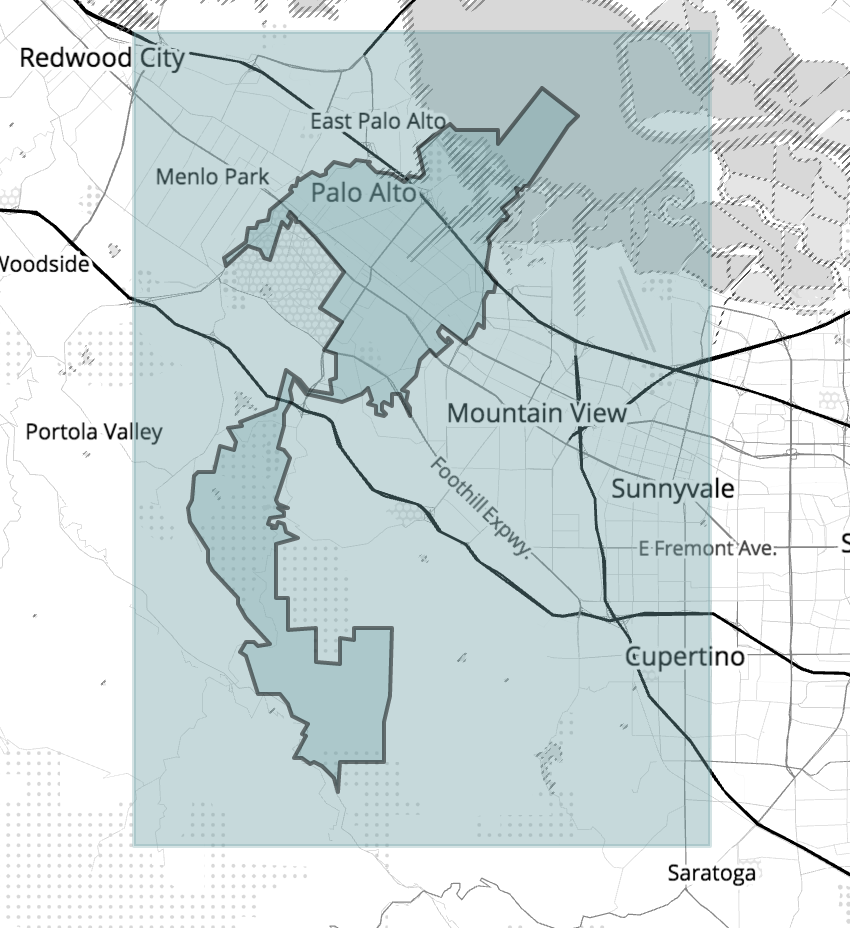

## Wrangle OpenStreetMap Data

This project contains 8 files:

 - `1_P1-OSM.md` the document derived from `iPython` and includes the wrangle process.
 - `2_audit.py` the python code used for extract the osm data and auditing the quality.
 - `2_clean.py` the python code used for cleaning the data.
 - `2_toCSV.py` and `2_toJSON.py` python code for converting the osm data to responded `SQL` or `MongoDB` format. The code come from course preparation part and the schema of data adopted from the course, too.
 - `3_link_n_description.txt` The link of osm data and simple description why it.
 - `4_example.osm` A sample data.
 - `5_refereces.txt` includes the link I used to complete the project.
